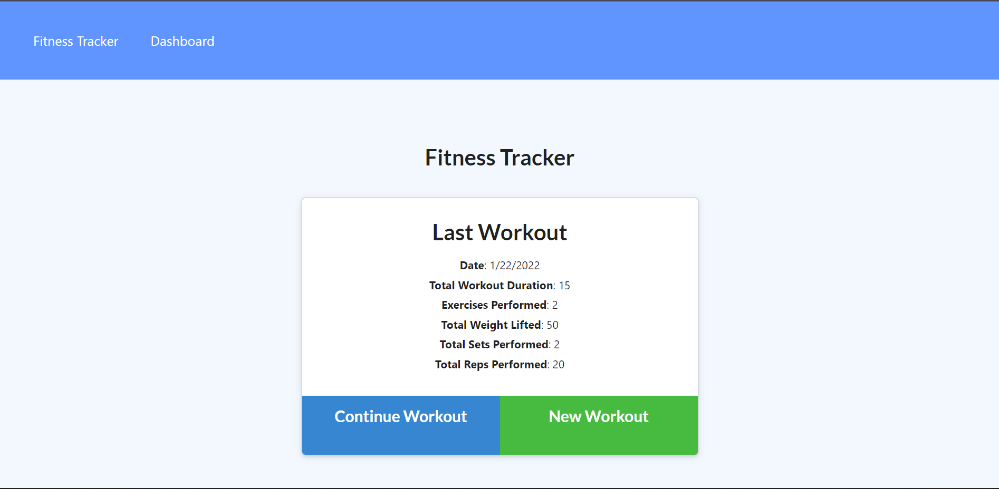

# WorkoutTracker_IJ
## Description
A wesbite for tracking your daily workouts that allows for viewing compiled from the past 7 workouts.

## Table of Contents
- [Installation](#installation)
- [Usage](#usage)
- [Link and Screenshots](#link-and-screenshots)
- [Questions](#questions)

## Installation
The applications uses mongoose, morgan, express and dotenv packages.

## Usage
Use the 'new workout' button to add your daily workout and then add the exercises in the workout to tracker. Then the users stats can be viewed from the homepage or dashboard.

## Link and Screenshots
Here is a link to the [deployed site](https://workout-tracker-ij.herokuapp.com/)

## Questions
You can find me on [Github](https://github.com/IsaacJCarnes)

  

